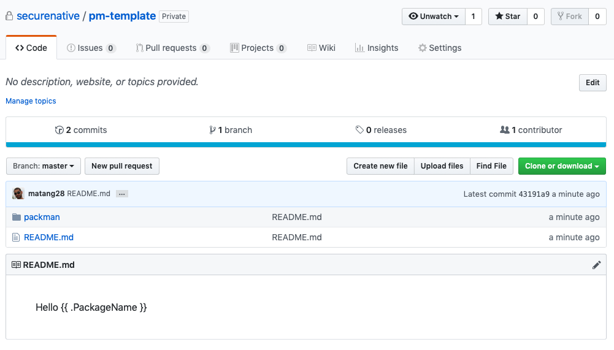

# Packman
Scaffolding was never that easy...

## Motivation
At SecureNative, we manage lots of microservices and the job of creating a new
project, wiring it up, importing our common libs is a tedious job and should be automated :)

packman was created to tackle this issue, as there are other good scaffolding tools (such as Yeoman), we've just wanted a simple tool that 
works simply enough for anyone to use.

## Prerequisites
- Go 1.11 or above with [Go Modules enabled](https://github.com/golang/go/wiki/Modules#how-to-use-modules)
- Basic knowledge of [Go's templating engine](https://curtisvermeeren.github.io/2017/09/14/Golang-Templates-Cheatsheet)
- Git
- A Github account token (only if you want to publish new packages)

## Quick Example
First, lets install packman, assuming you've installed go correctly just use:
```bash
go get -u github.com/securenative/packman
```

Inorder to start a new template you may use packman's init, which generates the template seed:  
```bash
$> packman init my-app-template
```  
You'll see that a new folder is created for your template (named `my-app-template` obviously),
inside that folder you'll find another folder called `packman` which contains our scaffolding script (more about that later)

Now, lets create a simple file in the root folder:
```bash
$> echo "Hello [[[ .PackageName ]]]" > README.md
```
Lets check how the rendered version of our newly created template will look like by running:
```bash
$> packman render my-app-template my-app-template my-app-template-rendered
$> cat my-app-template-rendered/README.md
Hello my-app-template
```

Wow, the `[[[ .PackageName ]]]` placeholder was replaced with our package name, miracles do exists :) 

Lets assume that we are happy with our template and we want to publish it so other users can use as well, Packman uses Github as the package registry so lets configure our github account:
```bash
$> packman config github --username matang28 --token <GITHUB_TOKEN> --private
```

Now we are ready to push our template to Github by just doing:
```bash
$> packman pack securenative/pm-template my-app-template
```


And Voila! we just created our first template and pushed it to Github, Now anyone can pull it and use our template for its own use by just doing:
```bash
$> packman unpack securenative/pm-template my-app
$> cat my-app/README.md
Hello securenative/pm-template
```

That's it! now, with the help of the `packman` you can easily create your project template, and render it based on the data generated from your script file.

## How it works
If you read and followed the `Quick Example` you may have many questions about packman, we'll try to answer them now.  
Understanding how packman works is crucial if you want to use it, but first lets define following:
- **Project Template** - this is the un-rendered version of your project, will contain the template files and the activation script.
- **Activation Script** - this script will be invoked by packman when calling `render`/`unpack`, the flags you give to these commands will be forwarded to the script file.
The responsibility of this script is to create the data model that can be queried by Go's templating directives. (`[[[ .PackageName ]]]` for example)

Packman uses a simple approach to render your project, at first packman will run you **Activation Script**, Let's examine the simplest form of an **Activation Script**
```go
package main

import (
	"os"
	pm "github.com/securenative/packman/pkg"
)

type MyData struct {
	PackageName string
	ProjectPath string
	Flags map[string]string
}

func main() {
	// Parse the flags being forwarded from packman commands:
	// This is how we can use custom flags
	flags := pm.ParseFlags(os.Args[2:])
	
	/**
        YOUR CUSTOM LOGIC
	 **/
	
	// The next step is to build our data model, the data model will be used by
	// the template directives.
	model := MyData{
		PackageName: flags[pm.PackageNameFlag], // Here we can see that [[[ .PackageName ]]] refers to this field 
		ProjectPath: flags[pm.PackagePathFlag], 
		Flags: flags,
	}

	// You must reply your data model back to the packman's driver
	pm.Reply(model)
}
```

Next, packman will go through your project tree and render each file using Go's template engine and the data model provided by your **Activation Script**, and ... That's it!

## API

### New Project
You can use packman to create a basic seed project which contains the basic structure of a packman template.
```bash
packman init <folder-name>
```

### Render
As the **Template Project** grows you'll need a way to quickly check that your project is rendered correctly,
The render will take the path of your **Template Project** and the path to the rendered output and any custom flags you wish to forward to your **Activation Script**.
```bash
packman render <package-name> <path-to-template> <path-to-output> -customflag1 value1 -customflag2 value2 ...
```

## Unpack
Unpack is the "wet" version of render, the only difference is that unpack will pull a template from the remote storage instead of you local file system.
```bash
packman unpack <package-name> <path-to-output> -customflag1 value1 -customflag2 value2 ...
```

## Pack
Pack will take a **Template Project** and will push it to the remote storage so others can use it.
```bash
packman pack <package-name> <path-to-template>
```

## Configuration
Packman supports local persistent kv-storage so you can store any kind of configurations with it, but currently only github configuration is supported.
```bash
packman config github --username <github-username> --token <github-personal-token> [--private]
```
The `--private` flag will indicate that we will pack the template as a private github repository instead of a public one.